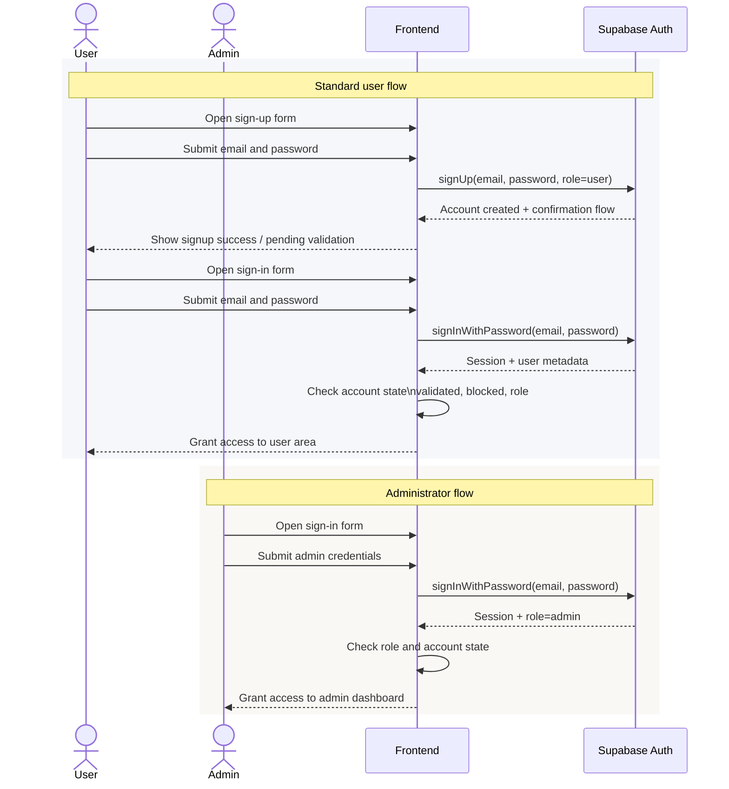

# Authentication Sequence Diagram

```mermaid
sequenceDiagram
    actor User
    actor Admin
    participant Frontend
    participant Supabase as Supabase Auth

    rect rgb(245, 247, 250)
        note over User,Supabase: Standard user flow
        User->>Frontend: Open sign-up form
        User->>Frontend: Submit email and password
        Frontend->>Supabase: signUp(email, password, role=user)
        Supabase-->>Frontend: Account created + confirmation flow
        Frontend-->>User: Show signup success / pending validation

        User->>Frontend: Open sign-in form
        User->>Frontend: Submit email and password
        Frontend->>Supabase: signInWithPassword(email, password)
        Supabase-->>Frontend: Session + user metadata
        Frontend->>Frontend: Check account state\nvalidated, blocked, role
        Frontend-->>User: Grant access to user area
    end

    rect rgb(250, 248, 245)
        note over Admin,Supabase: Administrator flow
        Admin->>Frontend: Open sign-in form
        Admin->>Frontend: Submit admin credentials
        Frontend->>Supabase: signInWithPassword(email, password)
        Supabase-->>Frontend: Session + role=admin
        Frontend->>Frontend: Check role and account state
        Frontend-->>Admin: Grant access to admin dashboard
    end
```
