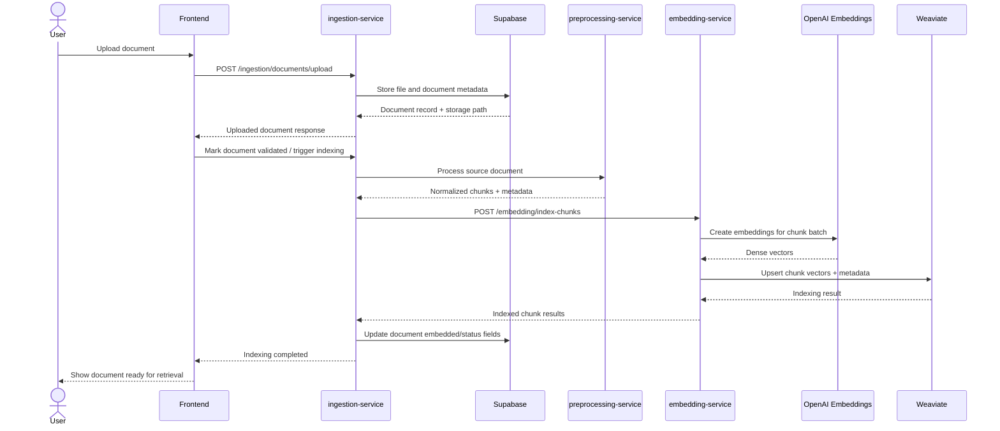

# Ingestion Sequence Diagram

```mermaid
sequenceDiagram
    actor User
    participant Frontend
    participant Ingestion as ingestion-service
    participant Supabase
    participant Preprocessing as preprocessing-service
    participant Embedding as embedding-service
    participant OpenAI as OpenAI Embeddings
    participant Weaviate

    User->>Frontend: Upload document
    Frontend->>Ingestion: POST /ingestion/documents/upload
    Ingestion->>Supabase: Store file and document metadata
    Supabase-->>Ingestion: Document record + storage path
    Ingestion-->>Frontend: Uploaded document response

    Frontend->>Ingestion: Mark document validated / trigger indexing
    Ingestion->>Preprocessing: Process source document
    Preprocessing-->>Ingestion: Normalized chunks + metadata

    Ingestion->>Embedding: POST /embedding/index-chunks
    Embedding->>OpenAI: Create embeddings for chunk batch
    OpenAI-->>Embedding: Dense vectors
    Embedding->>Weaviate: Upsert chunk vectors + metadata
    Weaviate-->>Embedding: Indexing result
    Embedding-->>Ingestion: Indexed chunk results

    Ingestion->>Supabase: Update document embedded/status fields
    Ingestion-->>Frontend: Indexing completed
    Frontend-->>User: Show document ready for retrieval
```

