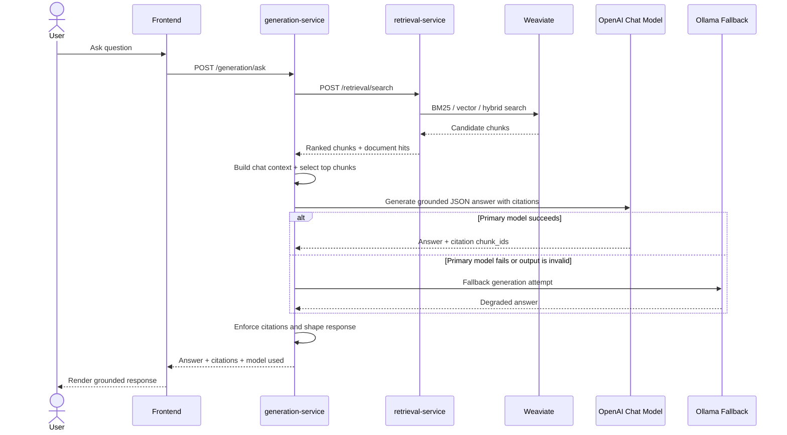

# Query and Generation Sequence Diagram

Notes:

- `generation-service` exposes both `/generation/chat` and `/generation/ask`.
- `/generation/ask` is the end-to-end path that first calls `retrieval-service`.
- Retrieval supports fusion and optional reranking before generation.
