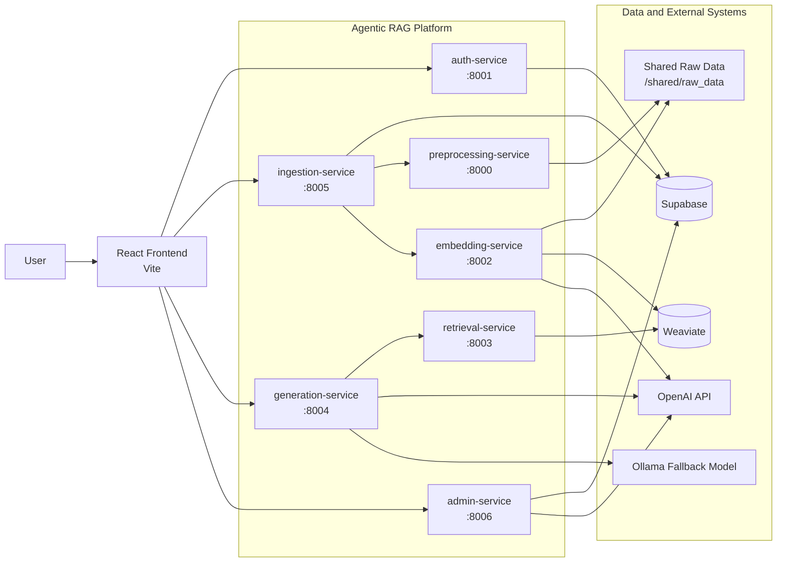

# System Component Diagram

Notes:

- `generation-service` performs retrieve-then-generate by calling `retrieval-service`.
- `embedding-service` depends on `preprocessing-service` and writes vectors to Weaviate.
- `admin-service` orchestrates operational tools across the backend services.
